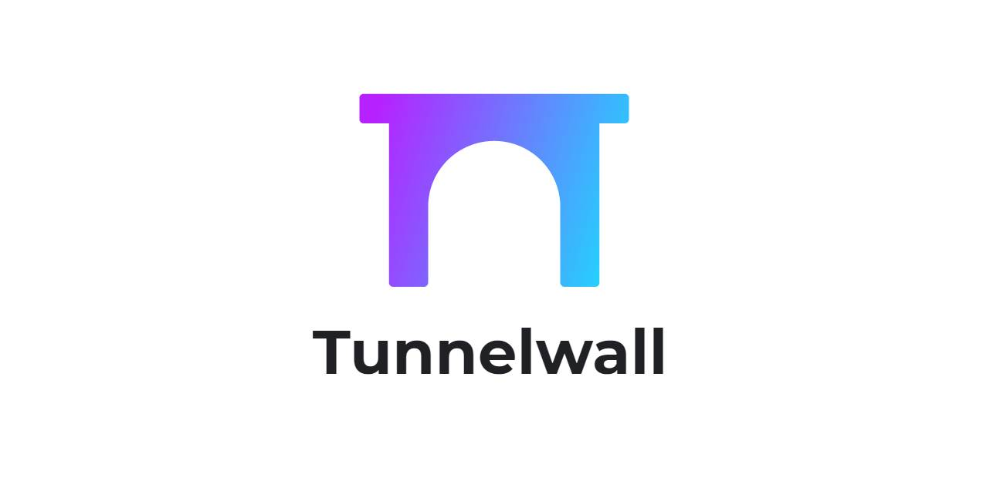
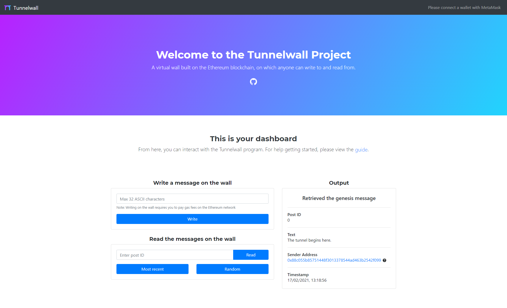
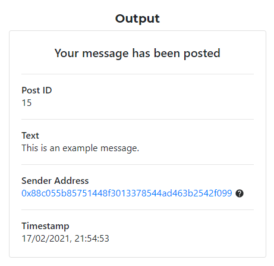
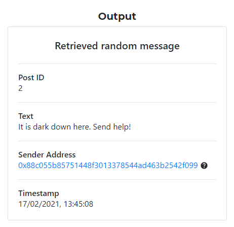

# 
<h4 align="center">A pseudo-anonymous message board on the Ethereum blockchain.</h4>
<h4 align="center"><a href="https://tunnelwall.com" target="_blank">tunnelwall.com</a></h4>
 

	
	
	

	
	
	
	

## About
Tunnelwall is a project developed by [Josh Stow](https://jstow.com), and serves as a pseudo-anonymous message board stored on the Ethereum network. Anyone in the world can write on the wall, and equally read from it. The wall has no censorship, as when a message is written, it remains there on the blockchain for eternity.

## Motivation
The project serves as an interactive experience for newcomers to blockchain technologies, who wish to understand more about decentralised applications - in particular those on the Ethereum network. It aims to be accessible to induviduals regardless of technical background, and is open-source, which allows those who would like to know how it works to view the code.

## Screenshots
### Main site

### Output field
 
## Built with
- [React](https://reactjs.org/)
- [create-react-app](https://github.com/facebook/create-react-app)
- [React-Bootstrap](https://react-bootstrap.github.io/)
- [Remix](https://remix.ethereum.org/)
- [Truffle](https://www.trufflesuite.com/)
- [Firebase](https://firebase.google.com/)

## How to use?
1. Visit the [Tunnelwall website](https://tunnelwall.com)
2. Download the MetaMask extension for your current browser from [here](https://metamask.io/download.html)
3. Start MetaMask, then read and accept the terms & conditions. Enter a secure password and create your wallet. Make sure to create a copy of your seed phrase and keep it secure
4. When writing a message on the wall you will need to pay a small transaction fee in the form of gas, paid in Ether. The fee varies depending on how busy the network is at the time
5. To top up your MetaMask wallet with Ether, either buy some using currency on exchanges like [Coinbase](https://www.coinbase.com/) or [Binance](https://www.binance.com/en) and transfer it, or send it from an Ethereum wallet you own which already contains some
6. When reading messages from the wall, you will not need to pay any transaction fees, but you will need to be connected with the MetaMask extension in order to communicate with the blockchain

## Credits
Many thanks to the help from tutorials by
- [Edson Ayllon](https://medium.com/fullstacked/connect-react-to-ethereum-b117986d56c1)
- [Jake Richards](https://medium.com/swlh/how-to-deploy-a-react-app-with-firebase-hosting-98063c5bf425)

## License
MIT © [Josh Stow](https://jstow.com)